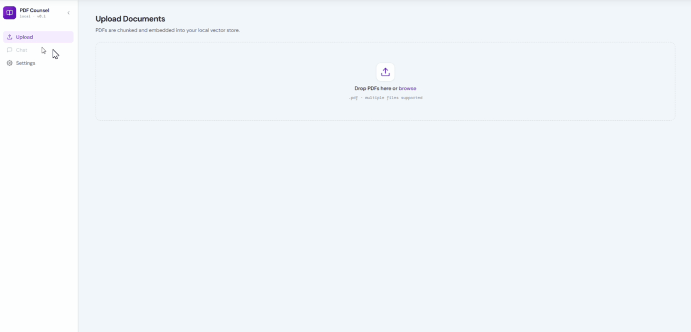

# pdfcounsel


**Chat with any legal document. Get verbatim citations, not summaries.**

Upload a PDF (or a stack of them), ask a question, and get an answer that quotes the exact passage — verbatim text, document name, page number. Every answer is grounded in what you uploaded. If it's not in the document, it says so.

No data leaves your machine except the OpenAI API call.



---

## What it does

- Upload one or more PDFs and ask questions across all of them simultaneously
- Every answer includes the **verbatim source passage**, the **document filename**, and the **page number**
- If the answer isn't in any loaded document, it says so — no hallucinated citations, ever
- Documents are indexed locally; re-uploading the same file is a no-op

Built for engineers and compliance people who need specific, citable answers from dense regulatory documents — EU AI Act, GDPR, DORA, NIS2, contracts, anything.

---

## Quick start

### Step 1 — Get an OpenAI API key

pdfcounsel uses OpenAI for embeddings and chat. You need an API key before you can use it.

Go to [platform.openai.com/api-keys](https://platform.openai.com/api-keys), create a key, and keep it somewhere handy. You'll paste it into the Settings page on first launch. It's stored locally and never sent anywhere other than the OpenAI API.

---

### Step 2 — Run the app

**Option A — Docker (recommended)**

Requirements: Docker and Docker Compose.

```bash
git clone https://github.com/steamedeo/pdfcounsel
cd pdfcounsel

# macOS / Linux
./docker-run.sh

# Windows
.\docker-run.ps1
```

The script checks that Docker is running, builds the images, starts everything in the background, and opens [http://localhost](http://localhost) automatically.

**Option B — Local (no Docker)**

Requirements: Python 3.10+, Node.js 18+.

```bash
git clone https://github.com/steamedeo/pdfcounsel
cd pdfcounsel

# macOS / Linux
./run.sh

# Windows
.\run.ps1
```

The script installs dependencies, starts the backend and frontend, and opens the browser.

---

### Step 3 — Paste your API key

On first launch, go to the **Settings** page and paste your OpenAI API key. That's it — upload a PDF and start asking questions.

Your key is stored in a local `.env` file (or a named Docker volume) and never leaves your machine except in requests to the OpenAI API.

---

## How it works

1. **Ingest** — PDFs are parsed page by page, split into chunks that respect legal document structure (articles, sections, clauses), and embedded with `text-embedding-3-small`. Vectors are stored locally as NumPy arrays.

2. **Query** — Your question is rewritten into three variants (original, legal phrasing, keyword-focused), each embedded and searched across all loaded indexes. The top candidates are reranked by an LLM before the answer is generated.

3. **Cite** — The model inserts inline source markers in its answer. At the end of the stream, the backend maps those markers to the retrieved chunks and emits a citations event — verbatim passage, filename, and page number.

---

## Stack

| Layer        | Choice                                                 |
| ------------ | ------------------------------------------------------ |
| Frontend     | SolidJS                                                |
| Backend      | FastAPI (Python)                                       |
| PDF parsing  | pypdf                                                  |
| Embeddings   | OpenAI `text-embedding-3-small`                        |
| Vector store | NumPy flat index (no external DB)                      |
| LLM          | OpenAI `gpt-4o-mini` (configurable via `OPENAI_MODEL`) |
| Streaming    | Server-Sent Events                                     |

No LangChain. No vector database. The RAG pipeline is ~400 lines of plain Python.

---

## Project structure

```
pdfcounsel/
├── backend/
│   ├── main.py        # FastAPI routes
│   ├── ingest.py      # PDF parsing, chunking, embedding
│   ├── retrieval.py   # Vector search
│   ├── chat.py        # Query rewriting, reranking, SSE streaming
│   └── history.py     # Chat history persistence
├── frontend/src/
│   ├── components/Chat.tsx
│   ├── components/Library.tsx
│   └── components/Settings.tsx
├── Dockerfile.backend
├── Dockerfile.frontend
├── docker-compose.yml
├── docker-run.sh / docker-run.ps1
├── run.sh / run.ps1
└── requirements.txt
```

---

## What it is not

- Not a general-purpose chatbot — it only answers from the documents you upload
- Not a SaaS product — runs entirely on your machine
- Not legal advice

---

## Roadmap

- Ollama support (fully offline, no API key required)

---

## License

[MIT](LICENSE)
